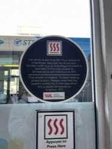

## Rapport d'activité
Bilan et Perspectives 
Dufaut-Knipping
Institution : IUT Bordeaux Montaigne / BUT INFONUM 
Année universitaire : 2023-2024
Image/Graphique : Sélectionnez une image ou un graphique qui symbolise votre parcours ou les thèmes abordés.

### Avant-propos (optionnel)

L’année 2021 a été marquée par la fin des années scolaires et mon arrivée à l’IUT Bordeaux-Montaigne. En 2021, j’ai découvert une formation, des professeurs et des personnes qui m’ont accompagné jusqu’à ce rapport qui marque la fin de ces trois années universitaires. 

Alors que touche la fin de mon stage à l’université de Montréal dans la Chaire de recherche sur les Écritures numériques, ce rapport d’activité apporte une conclusion sur mes compétences développées ainsi que mes expériences, sur mon évolution au sein de la promotion de 2021/2024, et sur les défis que j’ai rencontrés et surmontés au cours de cette période.

L'année 2024 a été une année de défis, mais aussi d'opportunités exceptionnelles. Grâce à l'engagement des professeurs et à leur investissement envers notre classe, j’ai pu approfondir mes compétences, découvrir de nouvelles choses, ainsi que suivre de nouveaux cours.

Je tiens à remercier chacun de mes professeurs pour leur passion et leur dévouement envers notre classe. Leur implication m’a permis de partir à l’étranger pour un stage particulièrement intéressant, de découvrir de nouvelles personnes et surtout d'explorer leurs métiers.

## 1.1 Présentation des Apports de la Formation

### Introduction : Brève présentation de l’année de formation.

Si je devais résumer mon année en quelques mots ce serait : « j’adore étudier les données ». Cette année a été marquée par l’expérimentation et l’approfondissement. L’accent en troisième année a été mis sur les données, leur création, leur analyse, leur visualisation ainsi que leur valorisation. Nous avons pu approfondir nos connaissances, nous spécialiser, et apprendre par la pratique la gestion de projets.

Nous avons eu de nouveaux cours où l'autonomie a primé. De nouveaux challenges nous ont été proposés et réussis. Nous avons eu des commanditaires de niveau départemental ainsi que national, ce qui nous a permis d’accéder à un niveau se rapprochant du professionnel. Je qualifierais aussi cette année d’« autonomie ». Apprendre à être autonome tant dans les projets que dans les cours : l’investissement devait venir de nous-mêmes. Pour évoluer cette année, il fallait avoir la volonté de réussir.

### Détail des réalisations et des compétences développées pendant les cours de 3A

En gestion de projet, nous avons eu des cours théoriques, étudié les méthodes à mettre en place, ainsi que les outils permettant une meilleure gestion de projet. 
Toutefois, nous avons étudié la gestion de projets tout au long de l'année grâce à notre rythme de travail : deux semaines de projets pour deux semaines de cours. Cela nous a permis de nous gérer, de nous comprendre et de réellement gérer des projets !

- Conférence Marcello
- Projet Gironde
- Visualisation
- Graphisme
- Données
- Challenge data
- Extension de la vie
- Vidéo
- Archiinfo
- Archivage numérique
- Communication interculturelle
- SIC
- Techniques de communication numérique
- Veille
- Initiation à la recherche
- Data jour

### Apprentissage et évolutions personnelles

Cette année partagée entre cours et projets m’a permis d’apprendre à mieux gérer le temps, le stress et la pression. Nous avons réalisé de nombreux projets durant ces trois ans, mais particulièrement en troisième année, des projets qui me plaisaient ou non. J’ai appris à m’adapter, à travailler en binôme ou en groupe. Chaque projet nécessite d’être autonome et organisé. Même si tous les projets n'ont pas été menés à bien, je me suis investi au maximum dans chacun d’eux, ce qui m’a permis de m'améliorer et d'apprendre. **J’ai tarpin évolué cette année.**

### Investissement et réussite durant les projets 

#### Projet de l'année : Gironde

##### Projet 1 : Cosma

Cosma est une interface conçue pour organiser des données de type wiki afin de faciliter l'analyse, la synthèse et le partage d'informations. Cosma est intéressant pour les projets impliquant la description et l'interconnexion d'éléments. Depuis ses débuts dans l'otletosphère, sa philosophie première demeure : connecter les fiches au sein d'un graphe cohérent.  Perret, A., Brioudes, G., Borel, C., & Le Deuff, O. (2023). Cosma (2.4.0). Zenodo. [https://doi.org/10.5281/zenodo.10252885](Perret, A., Brioudes, G., Borel, C., & Le Deuff, O. (2023). Cosma (2.4.0). Zenodo. https://doi.org/10.5281/zenodo.10252885) 
L'objectif du projet etait de comprendre ce qu'est l'open data, le vocabulaire qu'il recouvre et les acteurs impliqués ainsi que de mieux saisir le rôle des acteurs publics, des institutions et notamment des collectivités locales.
Nous avons réalisé un projet Cosma sur la sphère de l'Open Data. Nous nous sommes répartis en groupes pour créer des fiches en Markdown. Ensuite, certains d'entre nous ont travaillé avec le professeur pour apprendre à utiliser GitHub, stocker et récupérer toutes les fiches, puis les pousser (push) vers un dossier qui a permis de générer un graphique en ligne de commande. Enfin, nous nous sommes amusés à personnaliser les couleurs, les logos et à créer un Cosma attrayant à notre image. J’ai travaillé sur tous les aspects de ce projet, ce qui m’a permis d'acquérir un large panel de compétences et de savoir-faire.
Lien direct vers le projet : https://oledeuff.github.io/BUT-Infonum-3/opendata.html
Le projet a également été l'occasion de monter en puissance au niveau technique et d'apprendre diverses techniques et logiciels permettant d'organiser, structurer, et visualiser l'information. Il s'agissait donc d'apprendre à maîtriser le format d'écriture simplifié Markdown, à utiliser le logiciel Zettlr pour la rédaction de fiches Markdown, et à manipuler Cosma, un logiciel conçu par l'équipe de recherche E3D du Mica. Il fallait aussi documenter les actions réalisées en produisant des travaux explicatifs à diffuser en ligne, utiliser des espaces collaboratifs comme Github pour partager du code, appliquer les principes vus en cours d'architecture de l'information, mobiliser des compétences web notamment avec le CSS, utiliser Zotero en compatibilité avec un autre logiciel comme Cosma, et comprendre l'importance des formats de données.

##### Projet 2 : Hackathon

Un hackathon est un événement collaboratif que nous avons réalisé sur une journée avec des personnes issues de divers horizons (informatique, journalisme et métiers de l’information). Nous nous sommes réunis pour travailler intensivement sur un projet innovant. Nous devions trouver un algorithme à auditer et concevoir des méthodes d’exploration d’un ensemble d’algorithmes.

Avec mon équipe, nous avons décidé d’auditer AIRBNB du point de vue des propriétaires. Trois constats nous ont motivés :
1. Depuis son entrée sur le marché locatif en France, Airbnb n’a fait qu'accroître son nombre d’utilisateurs et de bénéfices. Dans ce contexte, les professionnels multipropriétaires de la location ont flairé la bonne affaire et ont investi la plateforme.
2. Du côté des locataires présents sur la plateforme, des incongruités quant au nombre de “vues” engrangées par une annonce sont remarquées (= incongruité quant au référencement). Il semble que la quantité de vues varie d’une année à l’autre sur une même période touristique. “Il faut attendre d'être présent depuis 2 ans sur l’appli pour être bien référencé.” (Source : connaissance membre du groupe)
3. Des boîtes de conseils en perfectionnement d’annonce se développent en avançant pouvoir améliorer la visibilité des annonces. De même, des auto-proclamés “spécialistes d’annonce” se multiplient sur les réseaux sociaux, dispensant des conseils qui prétendent améliorer la visibilité et, par là, les gains des locataires.
Lien direct vers le projet : https://github.com/oledeuff/BUT-Infonum-3/blob/585b1445295cb68bdd797420cdaf8e61a5c15fa9/archive.23-24/Projets/projet3.hackathon/documentationprojetAirbnb.md  

##### Projet 3 : Challenge de la data
Pour le chalenge de la data avec l'iut de Tours, nous avons travaillé une semaine sur ce projet. Dans l’esprit du challenge de la veille, nous avons travaillé par groupe une semaine de travail qui s'est déroulée du lundi 19 février 2024 au vendredi 23 février 2024 sur une problématique proposée par la SNCF. Il falait construire un argumentaire pour convaincre des élus régionaux de choisir le système proposé par le Consortium TLi, piloté par la SNCF, en fonction de critères de développement durable. 
Nous avons travaillé sur la question : "L'etude de l'accessibilité et de l'écotourisme en Bretagne et en PACA", notre travail s'est formé selon ces points : 
- Nous nous sommes alors demandés quelles régions seraient les plus accessibles et intéressantes pour proposer un plan de communication argumentatif pour tenter de les convaincre et permettre une réutilisation de notre raisonnement.
- Nous avons commencé à chercher les orientations politiques des différentes régions. On en a donc trouvé deux que nous trouvions pertinentes : Bretagne et Provence-Alpes-Côte-D’Azur (PACA), avec plusieurs objectifs différents, deux grandeurs différentes et des axes politiques différents. On
s’est directement accès sur ces deux régions par manque de temps pour des analyses plus fines.
 
    → La PACA semble être plus orientée vers une valorisation de leur territoire, l'écotourisme ainsi que le transport plus responsable.
    → La Bretagne, quant à elle, présente des objectifs sociaux intéressants à analyser. La région développe son réseau ferroviaire et cherche à l’améliorer. Ils ont aussi une volonté de valorisation du territoire que nous pouvons retrouver en PACA qui nous permettra de faire le lien entre les deux régions (tourisme).
    
La différence de taille en terme de nombre d’habitants entre ces deux régions a également pesé dans la balance quant à notre choix, car nous trouvions intéressant de comparer une région avec un nombre important d’habitants (la PACA avec 5 160 000 habitants) et une autre moins peuplée
(la Bretagne avec 3 429 900 habitants). 

Nous avons cherché une thématiques, trouvé et traité les données pour ensuite proposer nos arguments.  
--- rajouter visu ---

## Contributions personnelles et apports.
• Bilan autocritique.
• Synthèse Globale
• Apprentissages clés et domaines d’amélioration.
1.2 Expériences Professionnelles
• Stage(s) et Alternance
• Durée, entreprise et contexte socio-économique.
Disciplines
Littérature
Communication
Informatique
Champ d’expertise
Culture numérique
Édition numérique
Sciences humaines numériques
Littérature et médias
Avant-gardes littéraires
Littérature et savoirs
Théories de la création littéraire

Chaire de recherche du Canada sur les écritures numériques
Chaire de recherche du Canada
Faculté des arts et des sciences
Département des littératures de langue française
Objet de la recherche
Analyser les nouvelles formes d’écriture dans les environnements numériques. 

Importance de la recherche
Permettre de mieux comprendre les changements culturels déterminés par les technologies numériques et concevoir des outils pour répondre aux enjeux posés par ces changements. 

Affiliations
Unités de recherche
Centre de recherche interuniversitaire sur les humanités numériques
Laboratoire de THÉOrie de la LIttérature à l'époque du NUMérique
Infrastructure du Laboratoire de THÉOrie de la LIttérature à l'époque du NUMérique

• Missions, défis, et apprentissages.
Ce projet de stage s'insère dans la continuité des efforts pour améliorer et étendre les fonctionnalités de Stylo, en s'appuyant sur l'expertise de la Chaire de recherche du Canada sur les écritures numériques et le support de Huma-Num. Il ambitionne de repenser le rôle des revues savantes en sciences humaines et sociales et d'accompagner les acteurs de l'édition scientifique dans leur transition numérique. Cette démarche, bien que soutenue par une subvention désormais terminée, continue d'être développée et utilisée par une communauté grandissante, témoignant de son importance dans le paysage actuel de la publication scientifique. Le projet s’inscrit dans une perspective d’ingénierie de la recherche, en apportant des outils dédiés notamment en matière de publication et d’éditorialisation scientifique.

Stylo, un éditeur de texte conçu pour la rédaction d'articles scientifiques, vise à révolutionner l'ensemble de la chaîne éditoriale numérique pour les revues académiques en sciences humaines. Ce projet est développé en collaboration avec Érudit et Huma-Num,(rédaction d’Huma-Num.2020) et s'adresse aux auteurs et éditeurs dédiés à la publication scientifique de haute qualité. Traditionnellement, la structuration des documents est reléguée à la fin du cycle éditorial, bien qu'elle soit importante pour la diffusion numérique et devrait être intégrée dès la phase de rédaction par les auteurs eux-mêmes. La philosophie de Stylo est de confier aux chercheurs et éditeurs le contrôle du marquage des documents, en exploitant leur expertise sémantique plutôt que graphique.
Dans l’unité d'attache : Chaire de recherche du Canada sur les écritures numériques.
« Stylo est un outil de rédaction et d’édition qui répond aux exigences scientifiques, et actuellement utilisé par des revues savantes. Expérimenter avec Stylo ouvre la perspective de nouvelles pratiques d’écriture numérique tout en alimentant une réflexion théorique sur la structuration de notre pensé » (Roch Delannay, Antoine Fauchié et Marcello Vitali-Rosati.2023). 

Cosma (Perret et al. 2023a) est un outil de visualisation conçu pour les professionnels de l'information qui transforme des fichiers de texte simple avec des liens wiki en un réseau dynamique de cartes indexées. 
Il permet une navigation et un partage de documents de manière non linéaire, adaptée à diverses applications telles que la gestion d'un wiki personnel, d'un Zettelkasten, ou d'un jardin digital. Il est également utile pour concevoir des cartes conceptuelles et des réseaux liant individus et idées (Le Deuff et al, 2019), manipuler des références bibliographiques et des citations, ou travailler avec des recherches nécessitant des métadonnées temporelles. Cosma aide à créer une base de connaissances flexible, combinant des descriptions hypertextes détaillées avec des fonctionnalités de visualisation en forme de graphe, enrichies de liens retour contextuels, de citations générées automatiquement, de filtres basés sur les métadonnées, et bien plus (Perret et al, 2023b).
Cosma est prévu pour se superposer à un éditeur de texte tel que Stylo ; comme tous deux utilisent le langage markdown et héritent d’une philosophie des formats ouverts et de l’interopérabilité, leur articulation est donc non seulement possible, mais entrevue par les développeurs de Cosma. L’enrichissement et l’exploitation des données sémantiques contenues dans les articles est également une des pistes de développement en cours pour l’éditeur Stylo. Le projet du stage s’inscrit donc dans le projet d’amélioration et de mise à l’échelle de l’éditeur Stylo, porté par la Chaire de recherche du Canada sur les écritures numériques et le CRIHN. Ce projet est le prolongement du Développement partenariat Revue2.0, qui posait des bases pour repenser le rôle des revues savantes en sciences humaines et sociales et accompagner les acteurs de l’édition scientifique dans leur transition numérique. La subvention est officiellement terminée, mais l’outil d’édition est maintenu et utilisé par des milliers d’usager·es, et est une partie intégrante des activités du professeur Vitali-Rosati, soutenues actuellement par la Très Grande Infrastructure de recherche Huma-Num, en France.
Étant formé par les personnes qui ont pensé et développé Cosma, il est intéressant de pouvoir l'intégrer dans la revue scientifique Stylo.

L’objectif du projet Mitacs Globalink est d’intégrer l’outil de visualisation Cosma à l’éditeur de texte Stylo. La stagiaire sera la seule stagiaire affectée à cette tâche.

Cette intégration permettra un enrichissement des données des articles sur Stylo, pour les auteur·e·s comme pour les revues. Les auteur·e·s pourront valoriser les liens entre leurs propres textes, dans un prolongement de leurs propres activités de recherche en sciences humaines, et analyser et synthétiser leurs données de recherche de façon innovante et opérante. Les revues, quant à elles, pourront visualiser les références, les enjeux, les thématiques traversant l’ensemble de leur production, mais aussi des unités plus discrètes, comme les dossiers ou les articles eux-mêmes. Par exemple, l’identification rapide de thématiques permet concrètement une recherche plus efficace d’évaluateur·ices pour l’évaluation par les pairs, et la visualisation des références sur une année de production de la revue permet, de façon plus abstraite, de situer les articles dans l’actualité de leur propre champ d’études.  
Les tâches de la stagiaire se divisent en deux volets ; 1) l’un communicationnel, consistant en l’élaboration d’une documentation préalable à l’intégration (analyse détaillée des possibilités et des besoins), puis le développement de tutoriels, d’instructions et de guides d’usage après la réalisation de l’intégration et 2) l’autre volet technique, consistant en l’intégration concrète de l’outil de visualisation dans l’éditeur Stylo.
Pour atteindre les objectifs énoncés dans le projet de stage, il est essentiel d'adopter une approche méthodique et bien structurée, qui s'articule autour des deux volets principaux de la mission de la stagiaire. Voici les approches spécifiques qui seront utilisées pour chaque volet :
Volet communicationnel :
Analyse des besoins et des possibilités : Avant tout, il est crucial de comprendre en profondeur les fonctionnalités existantes de Stylo et de Cosma, ainsi que les besoins et les attentes des utilisateurs finaux. Cette analyse implique des entretiens avec des utilisateurs potentiels, des sessions de brainstorming avec les développeurs et une revue de la littérature sur les pratiques actuelles en matière de publication scientifique et de visualisation de données. L'objectif est d'identifier clairement comment Cosma peut compléter et améliorer l'expérience utilisateur de Stylo.
Développement de la documentation : À partir des informations recueillies, la stagiaire élaborera une documentation détaillée qui servira de fondement à l'intégration de Cosma dans Stylo. Cette documentation comprendra des scénarios d'utilisation, des spécifications fonctionnelles, et une évaluation des impacts potentiels sur les workflows existants.
Création de matériel pédagogique : Après l'intégration de Cosma, la stagiaire développera des tutoriels, des instructions pas à pas, et des guides d'utilisation qui faciliteront l'adoption de l'outil par les chercheurs et les éditeurs. Ces ressources seront conçues pour être accessibles à des utilisateurs de différents niveaux de compétence technique et mettront l'accent sur la mise en valeur des nouvelles possibilités offertes par l'intégration.
Volet technique :
Conception et développement : Sur le plan technique, la stagiaire travaille en étroite collaboration avec l'équipe de développement pour concevoir l'architecture de l'intégration de Cosma dans Stylo. Cette phase inclura la définition des interfaces de programmation applicatives (API) nécessaires, la sélection des technologies et outils à utiliser, et l'élaboration d'un plan de développement détaillé.
Intégration et tests : La mise en œuvre de l'intégration consistera en une série d'itérations de développement, suivies de tests rigoureux pour assurer la compatibilité, la performance, et l'utilisabilité de l'intégration. Les tests incluront des évaluations automatisées et manuelles, ainsi que des sessions de feedback avec des utilisateurs cibles pour valider l'expérience utilisateur et ajuster l'implémentation en conséquence.
Déploiement et suivi : Après l'achèvement des tests et l'approbation finale de l'intégration, la stagiaire supervisera le déploiement de la solution intégrée. Cette phase sera suivie d'une période de suivi pour identifier et corriger les éventuels problèmes post-déploiement, ainsi que pour recueillir des retours supplémentaires des utilisateurs pour des améliorations futures.
En adoptant ces approches dans les volets communicationnel et technique, le projet vise à assurer une intégration réussie de Cosma dans Stylo, améliorant ainsi l'efficacité et l'impact de la publication scientifique en sciences humaines
• Bilan personnel et professionnel.
• Synthèse des Expériences
• Leçons tirées et compétences développées.
1.3 Parcours Personnel et Professionnel
• Analyse du Parcours (bien décrire les évolutions professionnelles ressenties, les
constructions et ambitions personnelles qui en découlent)
• Projets Futurs et Objectifs d’Insertion
